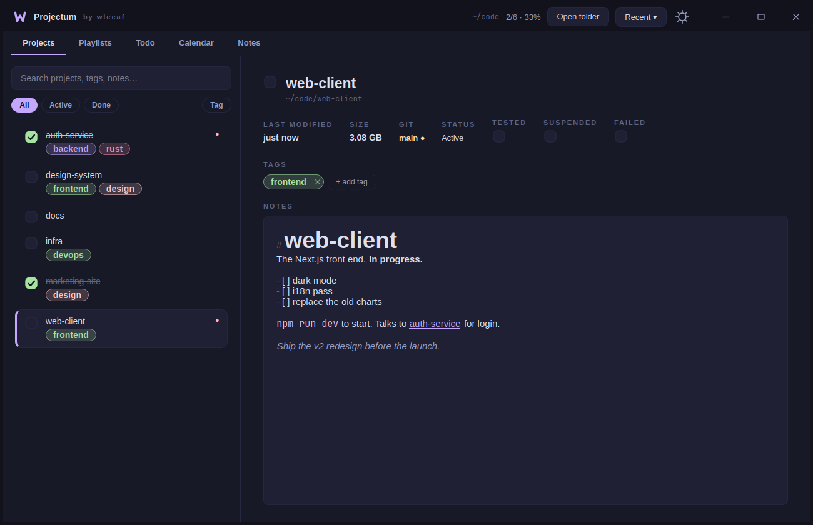
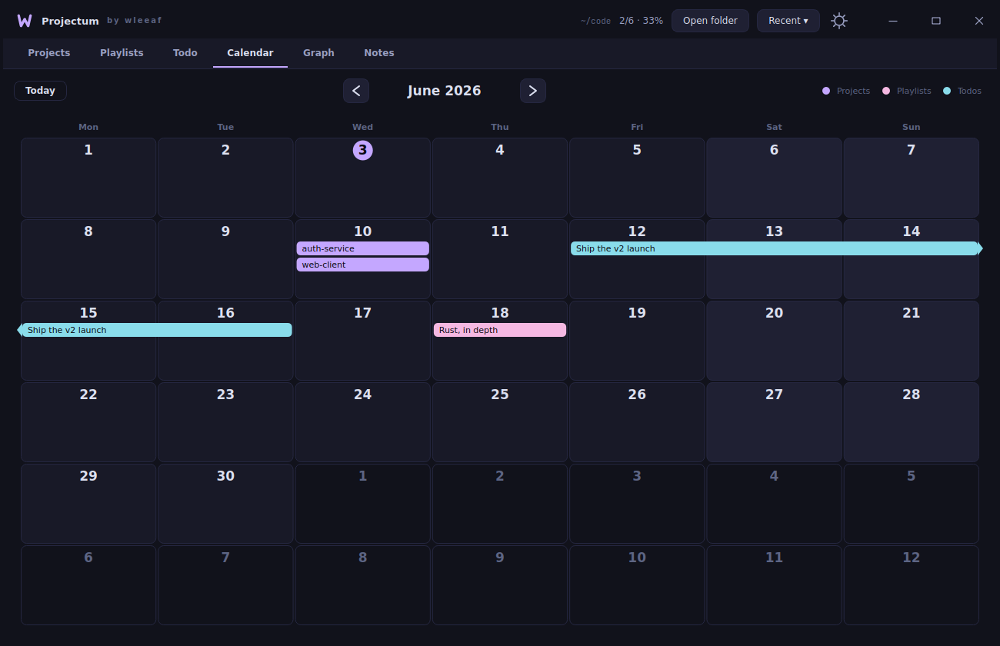
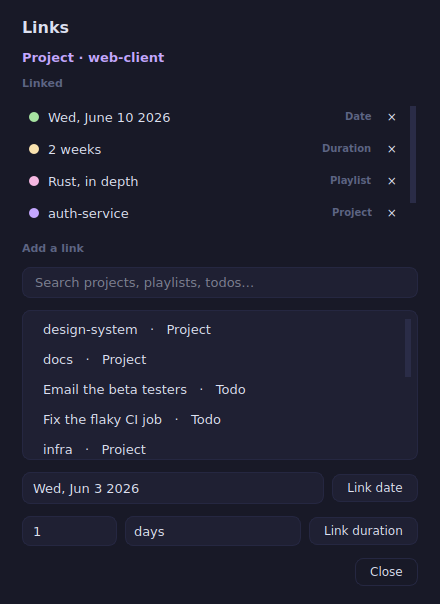
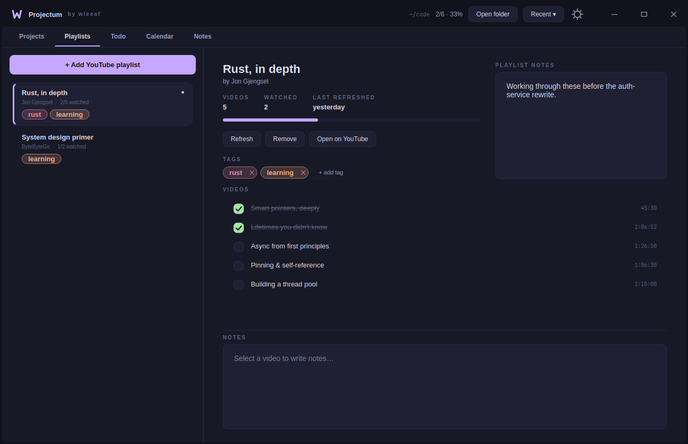
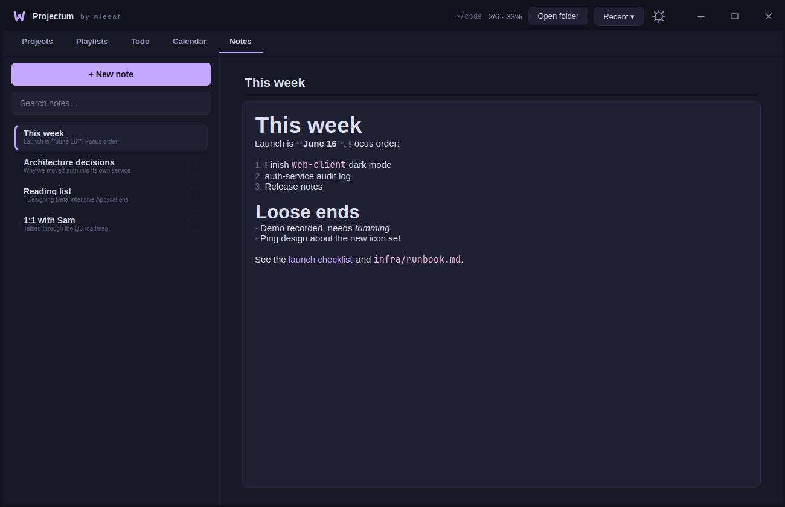
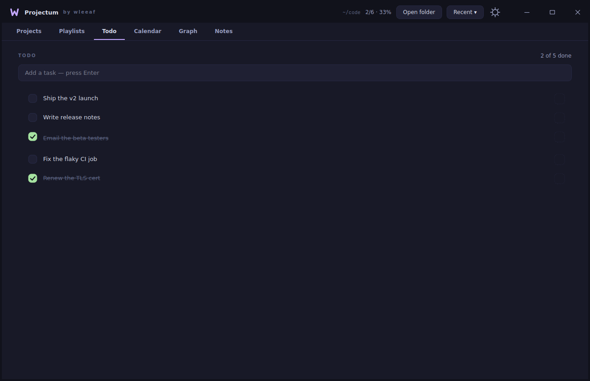
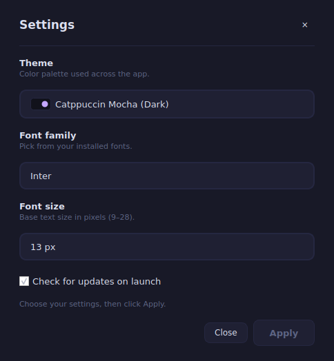
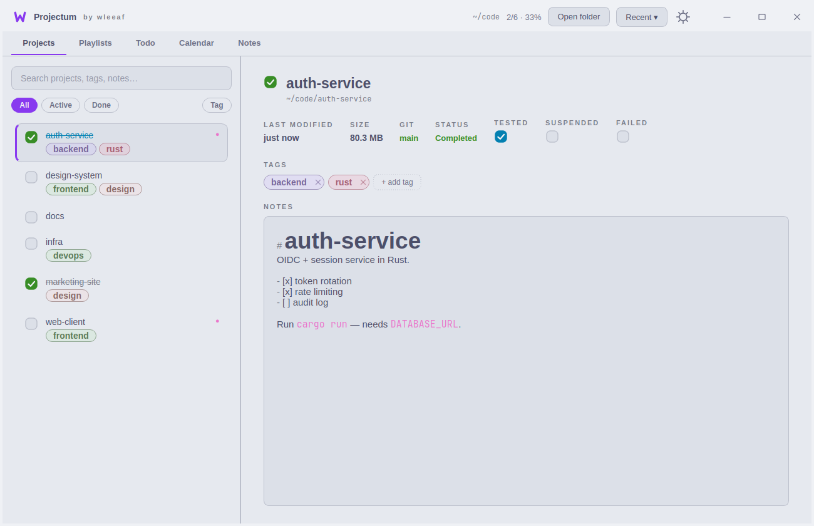

<div align="center">

# Projectum

Keep track of the things that pile up around a folder of work: the projects, the
YouTube playlists you're learning from, the loose to-dos, the notes. Connect any
of them to each other, or to a day on the calendar.

[](https://github.com/wleeaf/projectum/actions/workflows/ci.yml)
[](https://github.com/wleeaf/projectum/releases/latest)
[](https://pypi.org/project/projectum/)
[](https://github.com/wleeaf/projectum/releases)
[](https://www.python.org/downloads/)
[](LICENSE)
[](https://github.com/sponsors/wleeaf)

No servers, no account, no telemetry. Your per-folder data is one JSON file sitting next to your work.



</div>

---

## What it is

Point Projectum at a folder. Every subfolder shows up as a project you can mark done or tested, tag, pin, and annotate with live-rendered Markdown. The same window holds a to-do list, a notebook of Markdown notes, and your YouTube playlists (titles, durations, watched state, per-video notes, fetched with [`yt-dlp`](https://github.com/yt-dlp/yt-dlp)).

That part is per-folder, and it lives in a single `.projectum.json` inside the folder, so it travels with your work and diffs cleanly in Git.

The other half is **relations**. A project, a playlist, a todo, a calendar date, a span of days, even a bare duration like "2 weeks". Any of them can link to any other, and the **Calendar** is where date relations come together. Relations are global, so they reach across every folder you've opened (more on where they're stored [below](#where-your-data-lives)).

## Install

### pip — any platform with Python ≥ 3.10

```bash
pip install projectum
projectum
```

### Linux — AppImage

A single self-contained file. No Python, no `pip`, nothing to install; it bundles Python, Qt, PySide6, and `yt-dlp`.

```bash
wget https://github.com/wleeaf/projectum/releases/latest/download/Projectum-x86_64.AppImage
chmod +x Projectum-x86_64.AppImage
./Projectum-x86_64.AppImage
```

Runs on any reasonably modern x86-64 desktop (glibc ≥ 2.17).

### Windows & macOS

Grab `Projectum-windows-x64.exe` or `Projectum-macos.dmg` from the [latest release](https://github.com/wleeaf/projectum/releases/latest). These builds aren't code-signed, so the OS will grumble on first launch:

- **Windows:** SmartScreen → *More info → Run anyway*.
- **macOS:** right-click the app → *Open* (or System Settings → Privacy & Security → *Open Anyway*).

If that bothers you, running from source avoids it entirely.

### From source

```bash
git clone https://github.com/wleeaf/projectum.git
cd projectum
python -m venv .venv && source .venv/bin/activate    # Windows: .venv\Scripts\activate
pip install -r requirements.txt
python main.py                                        # or: python main.py ~/code
```

It remembers the last folder you opened and goes straight back to it next time.

## Relations: connect anything to anything

This is the part that makes Projectum more than a list of folders. Right-click almost anything — a project, a playlist, a todo — and pick **Links…**. From there you can attach it to:

- **another entity** (link the `web-client` project to the `auth-service` project, or to that Rust playlist you're working through);
- **a day** or a **date frame** (a span like June 12–16);
- **a duration** — an unanchored "2 weeks", "3 days", for when you care about *how long* a thing takes, not *when*.

Links go both ways: open the playlist later and the project is sitting right there as a backlink. None of it is typed or rigid. It's just "these things are related," which tends to match how you actually keep track of work. The add box is a focused search — start typing and press Enter to attach the top match, no clicking required.

The Calendar is the home for the date side of all this. Hover a day and it lights up; click it to pull up what's on it and attach more; drag across days for a span.

| | |
|---|---|
| **Calendar** — anything linked to a date shows up on that day; spans draw as bars. Click a day to attribute it, or drag across days for a frame.<br> | **Links** — the dialog behind it all: see and edit what an item connects to.<br> |
| **Playlists** — paste a URL, tick videos off, keep notes per video.<br> | **Notes** — a notebook of Markdown notes; syntax markers hide until you put the cursor on the line.<br> |
| **Todo** — quick folder-scoped tasks.<br> | **Settings** — theme, font, font size, update check.<br> |
| **Light theme** — one of nineteen.<br> | |

## The rest of it

- **Projects from the filesystem.** Each subfolder is a project. The detail panel shows its size, last-modified time, and current git branch + whether the tree is dirty (read off the UI thread, so it never blocks). Done and tested toggles, color tags with a sidebar filter, pin-to-top, drag to reorder.
- **Playlists with per-video tracking.** *Refresh* pulls in new uploads without losing your watched/notes state; anything removed upstream is kept and flagged rather than silently dropped.
- **Live Markdown** everywhere there's a notes pane. Headings, bold/italic, code, lists, quotes, and links render as you type. The syntax markers (`#`, `**`, backticks, link brackets) stay hidden until you move the cursor onto a line, then reappear so you can edit them — a live preview with no separate preview mode, and the document underneath is always plain Markdown.
- **Quick actions** on a project: open the folder, copy its path, open a terminal there, or open it in your editor (VS Code / Cursor / Zed / Sublime, if one's on your `PATH`).
- **Command palette** (`Ctrl+K`) over projects, playlists, videos, tags, and your notes — prefix-ranked, type-ahead.
- **Nineteen themes**, dark and light, from Catppuccin and Nord and Gruvbox to a few of my own (Midnight, Synthwave, Ember, Graphite, Paper). Every one is checked against a WCAG contrast floor in CI so text stays readable, and switching crossfades instead of snapping. Any installed font, any size.
- **Update check** — a quiet banner when a newer release exists. One read-only call to the GitHub releases API on launch, off by a toggle, and nothing is sent anywhere.
- **Resilient by default.** Saves are atomic. Rename a project folder or switch branches and its metadata is parked safely, then restored when the folder comes back.

## Keyboard shortcuts

| Shortcut            | Action                                                    |
|---------------------|-----------------------------------------------------------|
| `Ctrl+K`            | Command palette                                           |
| `Ctrl+1` … `Ctrl+5` | Switch tab (Projects / Playlists / Todo / Calendar / Notes) |
| `Ctrl+O`            | Open a folder                                             |
| `Ctrl+F`            | Focus the sidebar search                                  |
| `Ctrl+D`            | Toggle the selected project's *done* state                |
| `Ctrl+T`            | Jump to Todo and start a new task                         |
| `Ctrl+N`            | Focus the project notes editor                            |
| `Ctrl+R`            | Refresh the current folder                                |
| `Esc`               | Close a popup                                             |

## Where your data lives

Two places, and the distinction matters:

- **Per-folder state** is `<folder>/.projectum.json` — projects, playlists, tags, notes, pins, ordering. It's yours: commit it next to your work or `.gitignore` it. Writes are atomic (temp file, then rename), so an interrupted save can't corrupt it. When a folder disappears, its metadata waits in an `_orphans` bucket and comes back intact if the folder does.
- **App + relations** live under `~/.config/projectum/` (or `$XDG_CONFIG_HOME`): `state.json` for window geometry, last folder, and theme/font; `links.json` for the relation graph.

One honest caveat: because relations can cross folders, they're stored centrally in `links.json` rather than in any one folder's file. So unlike the rest of your data, **relations don't travel with a folder** — copy a project elsewhere and the per-folder JSON comes along, but the links you drew to things in *other* folders stay behind. It's the trade-off for being able to connect anything to anything.

## Building from source

```bash
python -m venv .venv && source .venv/bin/activate
pip install -r requirements.txt
python main.py
```

Dependencies are deliberately thin: `PySide6` for the UI, `yt-dlp` for playlist metadata, the standard library for the rest. CI runs `ruff`, byte-compiles every module, runs the `pytest` suite, and boots the window on a headless display across Python 3.10–3.12 on Linux, macOS, and Windows.

Run the tests:

```bash
pip install pytest
QT_QPA_PLATFORM=offscreen pytest -q
```

Build the AppImage locally:

```bash
pip install python-appimage build
./packaging/appimage/build-appimage.sh   # -> build/appimage/Projectum-x86_64.AppImage
```

### Layout

```
projectum/
├── main.py                  # entry point
├── projectum/
│   ├── app.py               # MainWindow + run()
│   ├── store.py             # Project / Playlist / Video / Todo / ProjectStore
│   ├── links.py             # the relation graph (entities, links, durations)
│   ├── calendar.py          # date logic + cross-folder scan (no Qt)
│   ├── widgets.py           # custom-painted widgets (calendar, chips, toggles, …)
│   ├── theme.py             # 19 themes + contrast helpers + stylesheet builder
│   ├── anims.py             # crossfade / slide / smooth-scroll helpers
│   ├── youtube.py           # yt-dlp fetch runnable
│   └── update.py            # the launch update check
├── packaging/               # AppImage, Flatpak, AUR recipes
├── .github/workflows/       # CI + release + PyPI pipelines
└── docs/screenshots/
```

## Support

Projectum is free and MIT-licensed. If it's useful to you and you feel like chipping in, you can [sponsor it on GitHub](https://github.com/sponsors/wleeaf) — completely optional, and it'll stay free either way, with no servers, accounts, or telemetry.

## License

[MIT](LICENSE) — © 2026 wleeaf.
