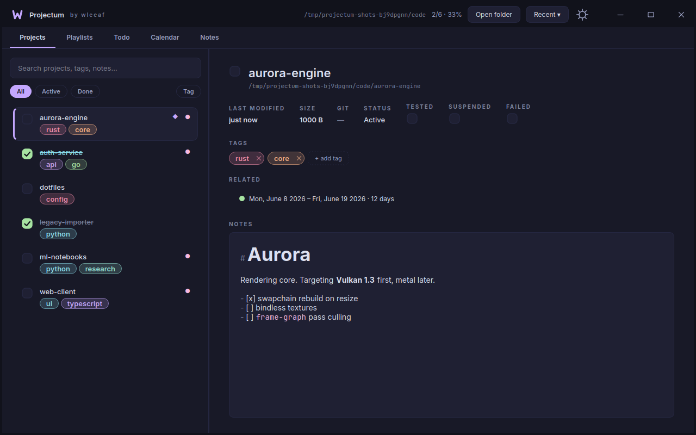
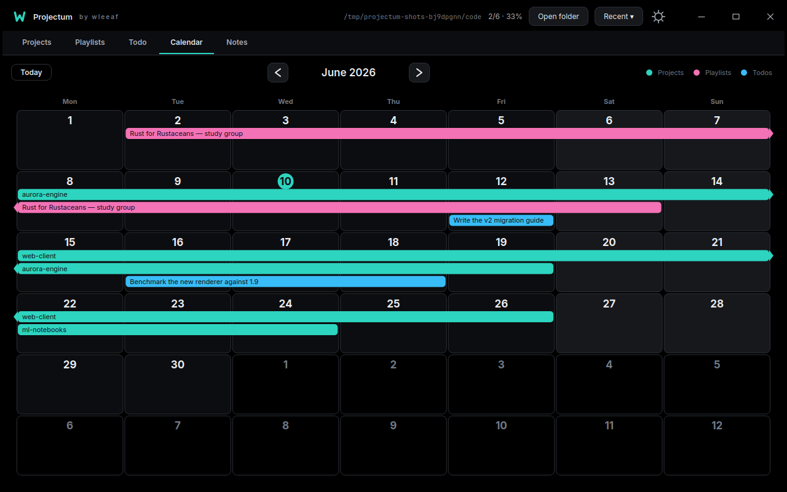
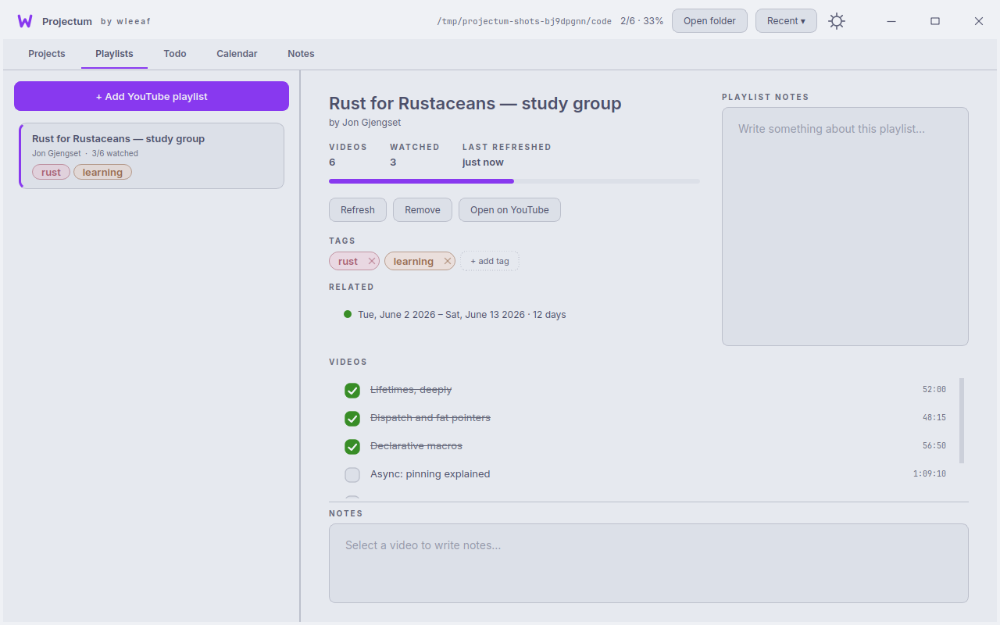
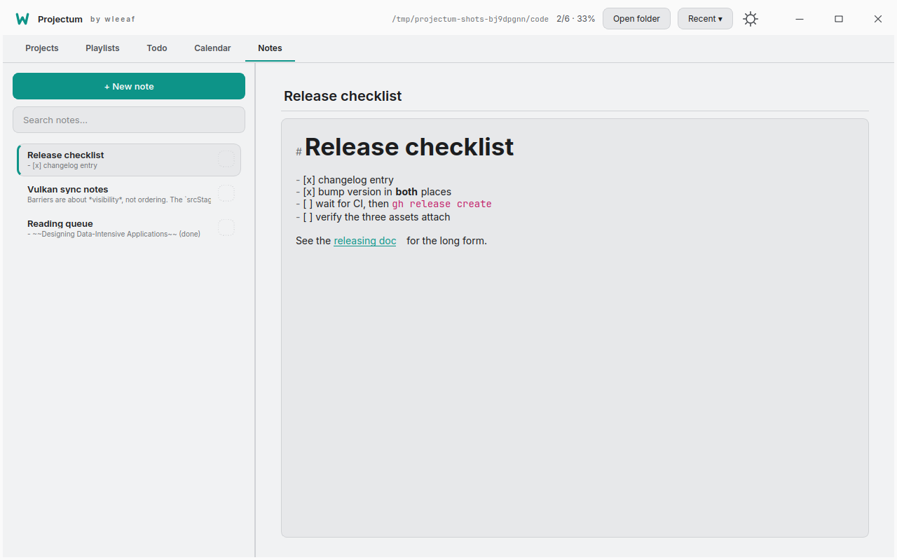
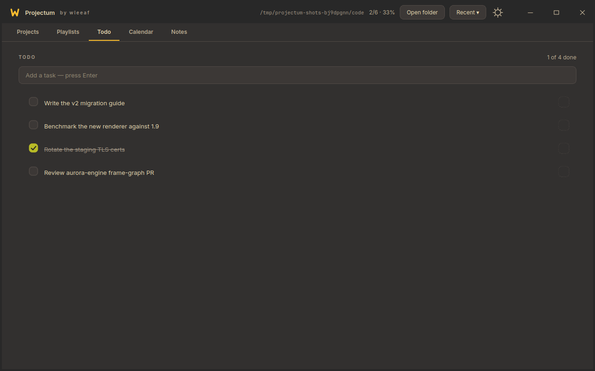

<div align="center">

# Projectum

**Everything that piles up around a folder of work — projects, playlists,
todos, notes — in one window, connected.**

[](https://github.com/wleeaf/projectum/actions/workflows/ci.yml)
[](https://github.com/wleeaf/projectum/releases/latest)
[](https://pypi.org/project/projectum/)
[](LICENSE)
[](https://github.com/sponsors/wleeaf)

No servers, no account, no telemetry. Your data is a JSON file sitting next to your work.

**[projectum.wleeaf.dev](https://projectum.wleeaf.dev)**



</div>

## How it works

Point Projectum at a folder. Every subfolder becomes a project you can mark
done or tested, tag, pin, and annotate with live-rendered Markdown. The same
window holds your todos, a notebook of notes, and your YouTube study
playlists (fetched with `yt-dlp`, watched-state per video). All of it lives
in one `.projectum.json` inside the folder — it travels with your work and
diffs cleanly in Git.

Then there are **relations**: link anything to anything — a project to a
playlist, a todo to a span of days, a note to a project. Date relations come
together on the **Calendar**, a month view where scheduled work draws as
bars across the weeks.

<div align="center">
<table>
  <tr>
    <td align="center" width="50%">
      <br>
      <sub><b>Calendar</b> — anything linked to a date shows on that day; spans draw as bars. <i>(Midnight)</i></sub>
    </td>
    <td align="center" width="50%">
      <br>
      <sub><b>Playlists</b> — paste a URL, tick videos off, keep notes per video. <i>(Light)</i></sub>
    </td>
  </tr>
  <tr>
    <td align="center" width="50%">
      <br>
      <sub><b>Notes</b> — live Markdown; syntax markers hide until your cursor enters the phrase. <i>(Paper)</i></sub>
    </td>
    <td align="center" width="50%">
      <br>
      <sub><b>Todo</b> — quick folder-scoped tasks, schedulable on the calendar. <i>(Gruvbox)</i></sub>
    </td>
  </tr>
</table>
</div>

## Install

```bash
pip install projectum && projectum
```

Or a package manager:

```bash
brew install --cask wleeaf/tap/projectum                                   # macOS
scoop bucket add wleeaf https://github.com/wleeaf/scoop-bucket && scoop install projectum   # Windows
yay -S projectum                                                           # Arch (AUR)
```

Or grab a standalone build from the [latest release](https://github.com/wleeaf/projectum/releases/latest):

| Platform | File | Notes |
|---|---|---|
| Linux | `Projectum-x86_64.AppImage` | `chmod +x`, run — bundles Python, Qt, `yt-dlp` |
| Windows | `Projectum-windows-x64.exe` | unsigned: SmartScreen → *More info → Run anyway* |
| macOS | `Projectum-macos.dmg` | unsigned: right-click → *Open* |

Or from source: `git clone`, `pip install -r requirements.txt`, `python main.py`.

Projectum keeps itself up to date: when a new release ships it installs in
place and offers a one-click restart (off by a toggle in Settings).

## Highlights

- **Filesystem-first projects** — size, last-modified, git branch and dirty
  state per project, read off the UI thread. Tags with sidebar filters,
  pin, drag to reorder, expand a folder of repos into nested projects.
- **Live Markdown everywhere** — headings, bold, code, lists, links render
  as you type; markers stay hidden until the cursor enters the phrase. The
  document underneath is always plain Markdown.
- **Relations** — undirected, untyped links between any two things,
  including dates, date spans, and bare durations ("2 weeks"). Backlinks
  show up on both sides; the detail panels show clickable chips.
- **Command palette** (`Ctrl+K`) across projects, playlists, videos, tags,
  and notes.
- **19 themes**, dark and light — every one CI-checked against WCAG
  contrast floors, switching crossfades. Any font, any size.
- **Resilient** — atomic saves; metadata for a renamed or deleted folder is
  parked and restored when it comes back.

<details>
<summary><b>Keyboard shortcuts</b></summary>

| Shortcut | Action |
|---|---|
| `Ctrl+K` | Command palette |
| `Ctrl+1` … `Ctrl+5` | Switch tab (Projects / Playlists / Todo / Calendar / Notes) |
| `Ctrl+O` | Open a folder |
| `Ctrl+F` | Focus the sidebar search |
| `Ctrl+D` | Toggle the selected project's *done* state |
| `Ctrl+T` | Jump to Todo and start a new task |
| `Ctrl+N` | Focus the project notes editor |
| `Ctrl+R` | Refresh the current folder |
| `Esc` | Close a popup |

</details>

## Where your data lives

- **Per-folder**: `<folder>/.projectum.json` — projects, playlists, tags,
  notes, ordering. Commit it next to your work or `.gitignore` it. Writes
  are atomic.
- **Global**: `~/.config/projectum/` — window state, theme, and
  `links.json`, the relation graph. Relations can cross folders, so they
  live here rather than in any one folder's file — the one part of your
  data that doesn't travel with a folder.

## Development

Dependencies are thin: `PySide6`, `yt-dlp`, and the standard library. CI
lints, byte-compiles, runs the test suite, and boots the window headless on
Linux/macOS/Windows across Python 3.10–3.12.

```bash
python -m venv .venv && source .venv/bin/activate
pip install -r requirements.txt pytest
QT_QPA_PLATFORM=offscreen pytest -q     # tests
python main.py                          # run
```

Packaging recipes (AppImage, Flatpak, AUR) live in [`packaging/`](packaging/),
the release process in [`RELEASING.md`](RELEASING.md).

## Support

Projectum is free and MIT-licensed, and stays that way. If it's useful, you
can [sponsor it on GitHub](https://github.com/sponsors/wleeaf) — completely
optional.

## License

[MIT](LICENSE) — © 2026 wleeaf.
