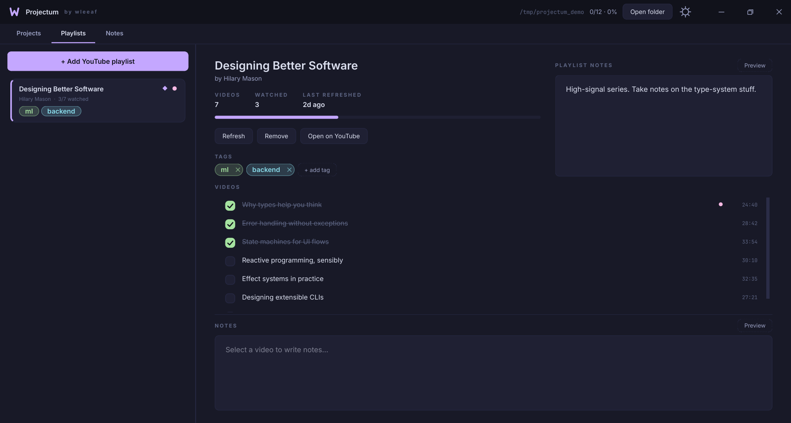
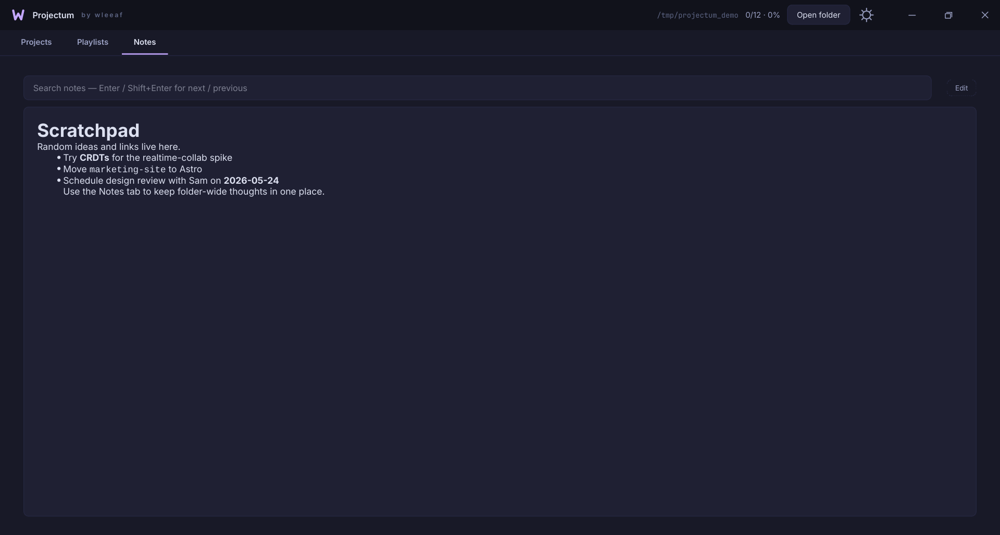
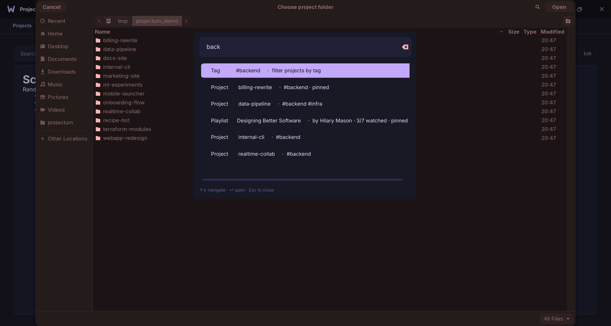
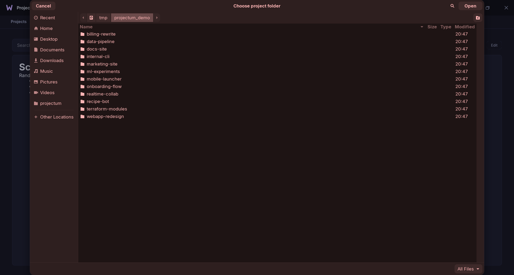
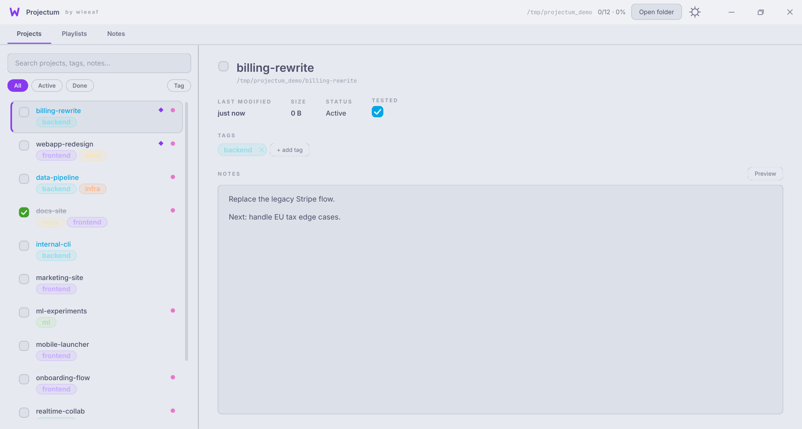

<div align="center">

# Projectum

**A keyboard-first desktop tracker for the projects, playlists, tasks, and notes that live in a folder on your disk.**

[](https://github.com/ts-solidarity/projectum/actions/workflows/ci.yml)
[](https://github.com/ts-solidarity/projectum/releases/latest)
[](https://github.com/ts-solidarity/projectum/releases)
[](https://www.python.org/downloads/)
[](https://doc.qt.io/qtforpython/)
[](LICENSE)

No servers. No accounts. No telemetry. Your data is one JSON file next to your work.


</div>

---

## What it is

Point Projectum at a folder and **every subfolder becomes a project** you can mark *done* and *tested*, tag with colors, annotate with live‑rendered Markdown, pin, and reorder. The same window tracks **YouTube playlists** — titles, durations, watched state, and per‑video notes via [`yt-dlp`](https://github.com/yt-dlp/yt-dlp) — keeps a **to‑do list** and a **folder‑wide scratchpad**. A `Ctrl+K` command palette searches across all of it.

Everything for a folder is stored in a single, human‑readable `.projectum.json` inside it — so it travels with your work, diffs cleanly in Git, and is trivial to back up or delete.

## Download

### Linux — AppImage (recommended)

Grab the latest self‑contained build, mark it executable, and run it. No Python, no `pip`, nothing to install.

```bash
wget https://github.com/ts-solidarity/projectum/releases/latest/download/Projectum-x86_64.AppImage
chmod +x Projectum-x86_64.AppImage
./Projectum-x86_64.AppImage
```

The AppImage bundles Python, Qt, PySide6, and `yt-dlp`, and runs on any reasonably modern x86‑64 desktop (glibc ≥ 2.17).

### Windows & macOS

Grab `Projectum-windows-x64.exe` or `Projectum-macos.dmg` from the [latest release](https://github.com/ts-solidarity/projectum/releases/latest).

> **Note:** these builds are **unsigned**, so the OS will warn on first launch.
> - **Windows:** SmartScreen → **More info → Run anyway**.
> - **macOS:** right‑click the app → **Open** (or System Settings → Privacy & Security → **Open Anyway**).
>
> If in doubt, running from source (below) avoids the warnings entirely.

### From source (Linux · macOS · Windows)

Requires **Python ≥ 3.10**.

```bash
git clone https://github.com/ts-solidarity/projectum.git
cd projectum
python -m venv .venv
source .venv/bin/activate          # Windows: .venv\Scripts\activate
pip install -r requirements.txt
python main.py                     # or: python main.py ~/code
```

Projectum remembers the last folder you opened, so later launches go straight back to it.

## Features

- **Filesystem‑backed projects.** Any folder works; each subfolder is a project. State lives in one `.projectum.json` per folder — Git‑friendly, sync‑friendly, no database.
- **YouTube playlists with per‑video tracking.** Paste a URL, `yt-dlp` fetches the metadata, tick videos off as you watch, and keep notes per video. *Refresh* later pulls in new uploads while preserving your progress; videos removed upstream are kept and flagged.
- **Live WYSIWYG Markdown** in every notes pane. Headings, bold/italic, inline and fenced code, lists, blockquotes, strikethrough, and links render as you type — the syntax markers stay dimmed but present, so it's still plain editable Markdown with no separate preview.
- **A folder-scoped Todo list** — quick tasks per folder: add, check off, double‑click to edit inline, delete, and drag to reorder, with a done/total counter.
- **Project quick-actions** — right‑click a project to open its folder, copy its path, open a terminal there, or open it in your editor (VS Code / Cursor / Zed / Sublime when on `PATH`).
- **Git-aware** — the detail panel shows a project's current branch and whether its working tree is dirty, read off the UI thread.
- **Recent-folders menu** — a **Recent ▾** button to jump back between the folders you track.
- **Tags with custom colors** (right‑click any chip), an automatic cleanup that drops unused colors, and a sidebar tag filter.
- **Done + Tested toggles** per project — a green check and a blue one; tested projects render in blue in the sidebar.
- **Pin & drag‑to‑reorder** projects and playlists; pinned items float to the top.
- **Command palette (`Ctrl+K`)** over projects, playlists, videos, tags, and the scratchpad, with prefix‑match ranking and type‑ahead.
- **9 built‑in themes** — Catppuccin Mocha & Latte, Nord, Dracula, Tokyo Night, Rosé Pine, Gruvbox, Solarized Dark & Light — plus **any installed font** at any size, switchable live.
- **Frameless, animated UI** with smooth wheel scrolling, custom title bar, edge‑resize, and flicker‑free crossfade transitions.
- **Resilient state.** Writes are atomic; a folder that disappears (rename, `git checkout`) has its metadata preserved and restored when it returns.

## Screenshots

|   |   |
|---|---|
| **Projects** — tagged, pinned, tested<br> | **Playlists** — videos, watched count, notes<br> |
| **Notes** — folder‑wide scratchpad, live Markdown<br> | **Command palette** — `Ctrl+K` over everything<br> |
| **Settings** — theme, font family, font size<br> | **Light theme** — same app, Catppuccin Latte<br> |

## Usage

**Projects** — Each subfolder of the chosen root is a row. Toggle **done** (green) or **tested** (blue); tested projects show their name in blue. Tags are inline chips — right‑click to recolor, click the **×** to remove, and filter by tag from the **Tag** chip at the top of the sidebar. Drag rows to reorder, or right‑click for **Pin to top** and quick actions (**Open folder / Copy path / Open in terminal / Open in editor**). The detail panel shows the folder's size, last‑modified time, and **git branch + dirty state**; the notes editor renders Markdown live, in place.

**Playlists** — **+ Add YouTube playlist** prompts for a URL; `yt-dlp` fetches the title, uploader, and every video. **Refresh** re‑syncs while keeping your watched/notes state. Tag, pin, reorder, and write per‑playlist notes; each video has its own notes pane below the list.

**Todo** — A folder‑scoped task list. Type a task and press Enter to add it; tick the toggle to complete it (it strikes through), double‑click the text to edit inline, drag to reorder, and use the **×** to delete. A counter shows how many are done.

**Notes** — A single, folder‑wide scratchpad with live WYSIWYG Markdown and a search bar (`↵` / `Shift+↵` to jump between matches).

**Command palette** — `Ctrl+K` from anywhere. Type to filter projects, playlists, videos, tags, and the scratchpad; `↑`/`↓` to navigate, `↵` to open, `Esc` to dismiss.

**Settings** — The gear icon opens theme, font family (any installed family — type to filter), and font size (9–28 px). Changes apply immediately and persist.

## Keyboard shortcuts

| Shortcut          | Action                                          |
|-------------------|-------------------------------------------------|
| `Ctrl+K`          | Open the command palette                        |
| `Ctrl+1` … `Ctrl+4` | Switch tab (Projects / Playlists / Todo / Notes) |
| `Ctrl+O`          | Open a folder                                   |
| `Ctrl+F`          | Focus the sidebar search                        |
| `Ctrl+D`          | Toggle the selected project's *done* state      |
| `Ctrl+T`          | Jump to Todo and start a new task               |
| `Ctrl+N`          | Focus the project notes editor                  |
| `Ctrl+R`          | Refresh the current folder                      |
| `↵` / `Shift+↵`   | Next / previous match in Notes search           |
| `Esc`             | Close a popup (color picker, settings, palette) |

## Data & storage

All state for a folder lives in `<folder>/.projectum.json` — a single JSON document holding projects, playlists, tags, notes, pins, and ordering. Commit it alongside your work or `.gitignore` it; it's yours. Writes are atomic (write‑temp‑then‑rename), so an interrupted save never corrupts the file.

The only thing written outside your folders is `~/.config/projectum/state.json` (or `$XDG_CONFIG_HOME`), which remembers your window geometry, last‑opened folder, and theme/font settings.

When a project folder disappears (rename, branch switch), its metadata — completion, notes, tags, pins, order — is parked in an `_orphans` bucket and restored intact if the folder reappears.

## Project layout

```
projectum/
├── main.py                  # entry point
├── projectum/
│   ├── app.py               # MainWindow + run()
│   ├── store.py             # Project / Playlist / Video / ProjectStore
│   ├── widgets.py           # custom-painted widgets (chips, toggles, palette, …)
│   ├── theme.py             # 9 themes + stylesheet builder
│   ├── anims.py             # crossfade / slide / progress / smooth-scroll helpers
│   ├── youtube.py           # yt-dlp fetch runnable
│   └── assets/icon.svg
├── packaging/appimage/      # AppImage recipe + build script
├── .github/workflows/       # CI + release (AppImage) pipelines
├── requirements.txt
└── docs/screenshots/
```

## Development

```bash
python -m venv .venv && source .venv/bin/activate
pip install -r requirements.txt
python main.py
```

The codebase is deliberately dependency‑light: `PySide6` for the UI, `yt-dlp` for playlist metadata, and the standard library for everything else. Continuous integration runs `ruff`, byte‑compiles every module, runs the headless `pytest` suite, and boots `MainWindow` on an `offscreen` display across Python 3.10–3.12 on Linux, macOS, and Windows.

Run the tests locally with:

```bash
pip install pytest
QT_QPA_PLATFORM=offscreen pytest -q
```

### Building the AppImage locally

```bash
pip install python-appimage build
./packaging/appimage/build-appimage.sh
# -> build/appimage/Projectum-x86_64.AppImage
```

## License

[MIT](LICENSE) — © 2026 wleeaf.
